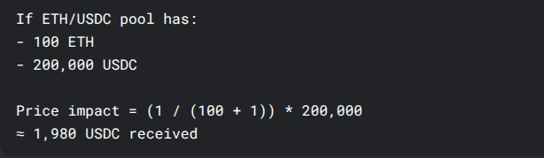
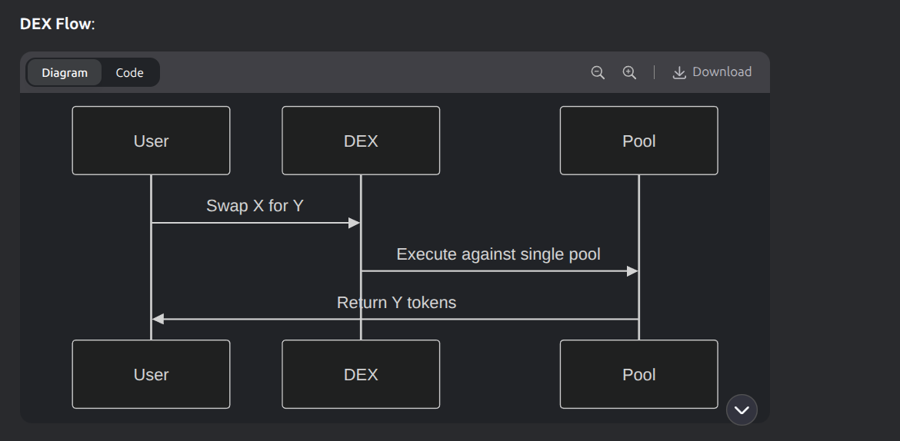
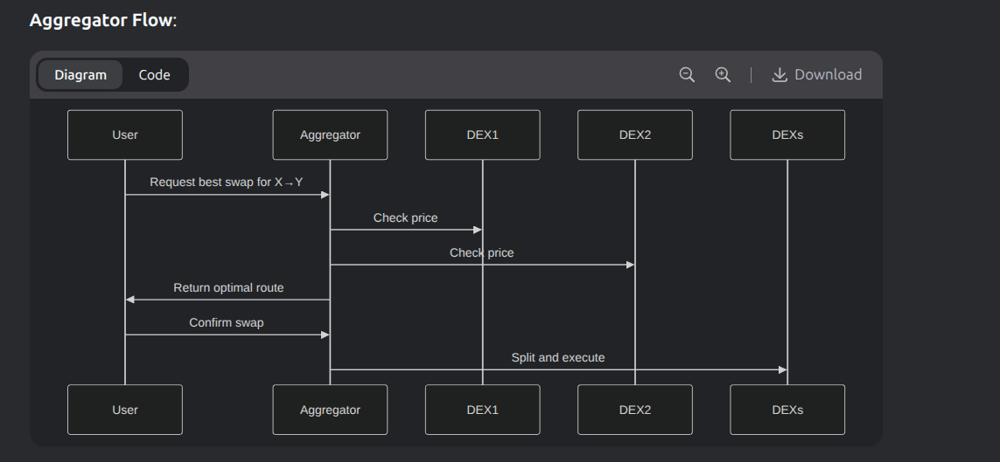
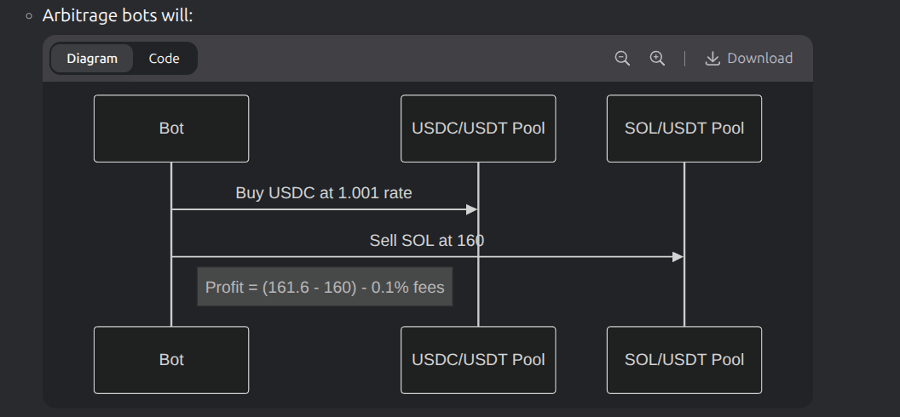

# 1. What is a DEX? (Decentralized Exchange)

## Definition

A **Decentralized Exchange (DEX)** is a peer-to-peer cryptocurrency exchange that operates without intermediaries, using smart contracts to facilitate automated trading directly between users' wallets.

## Key Characteristics

### 🟢 Advantages

- **Non-custodial**: Users retain control of their funds
- **Permissionless**: No KYC requirements
- **Transparent**: All transactions on-chain
- **Available 24/7**: No centralized downtime

### 🔴 Disadvantages

- **Slower speeds**: Limited by blockchain confirmation times
- **Higher fees**: Gas costs for on-chain operations
- **Complexity**: Steeper learning curve for beginners
- **Limited features**: Fewer order types than CEXs

## 2. Why we can't swap between one blockchain to another for e.g. SOL to ETH

### Different Languages

- Solana: Speaks "Rust"

- Ethereum: Speaks "Solidity"

- Neither understands the other

### Different Security Guards

- Solana validators don't know Ethereum rules

- Ethereum miners don't know Solana rules

### No Shared Clock

- Solana time ≠ Ethereum time

- Can't coordinate "simultaneous" swaps

## 3. difference between dex and cex

### Key Differences

| Feature               | DEX                           | CEX                         |
| --------------------- | ----------------------------- | --------------------------- |
| **Custody**           | Non-custodial (you hold keys) | Custodial (they hold keys)  |
| **Anonymity**         | No KYC required               | KYC verification needed     |
| **Security Model**    | Immune to exchange hacks      | Vulnerable to hacks         |
| **Liquidity Source**  | Liquidity pools               | Order books                 |
| **Transaction Speed** | Slower (on-chain)             | Faster (off-chain matching) |
| **Fees**              | Network gas fees              | Trading + withdrawal fees   |
| **Available Assets**  | Mostly cryptocurrencies       | Crypto + fiat pairs         |
| **Trading Interface** | Basic swap functionality      | Advanced charting tools     |

## 4. How DEXs work

### Liquidity Pools

- **Definition**: Pools of tokens locked in smart contracts
- **Function**: Provide liquidity for trades
- **Mechanism**: Users deposit tokens to earn fees

### Automated Market Makers (AMMs)

- **Definition**: Algorithms that set prices based on supply/demand
- **Function**: Automatically execute trades
- **Example**: Uniswap's constant product formula

### Constant Product Formula

- **Formula**: x \* y = k
  - x = amount of token A
  - y = amount of token B
  - k = constant (liquidity)
- **Mechanism**: Adjusts prices based on token ratios



### Impermanent Loss

- **Definition**: Temporary loss of funds due to price divergence
- **Mechanism**: Occurs when the price of tokens in a pool changes relative to each other
- **Impact**: Can lead to lower returns compared to holding tokens

### Slippage

- **Definition**: Difference between expected and actual trade price
- **Cause**: Market volatility or low liquidity
- **Impact**: Can result in worse trade execution than anticipated

### Front-running

- **Definition**: Exploiting knowledge of pending transactions
- **Mechanism**: Bots detect large trades and execute before them
- **Impact**: Can lead to higher costs for original traders

## 5. DEX Vs DEX Aggregators

### Core Definitions

| Feature       | DEX (Decentralized Exchange)    | DEX Aggregator                         |
| ------------- | ------------------------------- | -------------------------------------- |
| **Purpose**   | Direct token swapping via pools | Finds best prices across multiple DEXs |
| **Liquidity** | Own liquidity pools             | Aggregates liquidity from many DEXs    |
| **Example**   | Raydium, Orca (Solana)          | Jupiter, Dexlab (Solana)               |




Key takeaways for Solana users:

1. **For best prices**: Always start with Jupiter
2. **For new tokens**: Check Raydium/Orca directly first
3. **For large trades**: Aggregators significantly reduce slippage

## 6. DLMM and CLMM

### Core Concepts

| Feature             | DLMM (Discrete)            | CLMM (Concentrated)   |
| ------------------- | -------------------------- | --------------------- |
| **Inventor**        | Meteora (Solana)           | Uniswap v3 (Ethereum) |
| **Solana Adoption** | Drift, Meteora             | Orca Whirlpools       |
| **Liquidity Shape** | Step-function distribution | Continuous curve      |
| **Price Precision** | Fixed ticks (e.g., $0.01)  | Infinite granularity  |

## 7. Who decide the value of k in X \* Y = k

### Key Solana-Specific Points:

### a. Pool Creation:

- First LPs deposit tokens (e.g., 10 SOL + 200 USDC)

- k automatically becomes 10 \* 200 = 2,000

### b. Swapping:

- Each trade must satisfy (x - Δx) \* (y + Δy) ≈ k

- Example: Swapping 1 SOL gives ~22.22 USDC

- Fees make k grow slightly over time

### c. Liquidity Changes:

- Adding liquidity increases k proportionally

- Removing liquidity decreases k

```
Where This Happens:
On-chain: Pool accounts store x and y values

Programs: Like Raydium's AMM or Orca's Whirlpools enforce the math

No human control: k changes automatically via deposits/swaps
```

## 8. there is multiple pool like SOL/USDT & SOL/USDC . What if i purchase 100 SOL with USDC, how it will effect the price os SOL in SOL/USDT.

### Step-by-Step Process

1.  Initial Trade Execution:

    - You swap 100,000 USDC for SOL in SOL/USDC pool

    - Pool reserves change (example):

    ```
    Before: 10,000 SOL / 1,500,000 USDC (Price: 150 USDC/SOL)
    After: 9,900 SOL / 1,600,000 USDC (Price: ~161.6 USDC/SOL)
    ```

2.  Arbitrage Trigger:

    - Price discrepancy appears:

    - SOL/USDC: 161.6

    - SOL/USDT: Still 150 (assuming original 1:1 USDC/USDT)

    

3.  Final Equilibrium:

    - Both pools stabilize at new price (example):

    ```
    SOL/USDC: 160
    SOL/USDT: 159.8
    USDC/USDT: 1.001 (reflects slight stablecoin variance)
    ```
