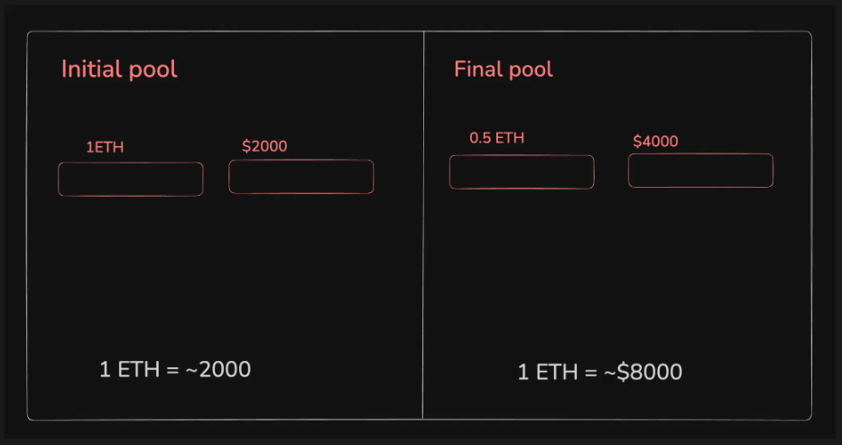

### Impermanent loss

Whenever you create a pool/provide liquidity to a pool, you can end up losing money in the long/short term.

### What is Impermanent loss

Impermanent loss refers to a situation where the compensation you receive from allocating a token in a liquidity pool is less than what you would have received just holding the asset.

This happens when a token’s price changes in the market, causing your allocated assets in the liquidity pool to become worth less than their present value in the market.

Let's say you deposit equal values of ETH and USDC into a liquidity pool:

- 1 ETH worth $2000
- 2000 USDC
- Total value: $4000

If ETH price goes up to $8000, what do you think happens?

### Staking Vs Trading

### LST

# FAQ

## What happen to staked SOL, if I swapped the HSOL to USDC can I still unstaked my staked SOL?

-
