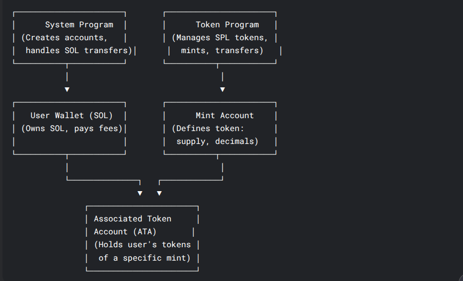
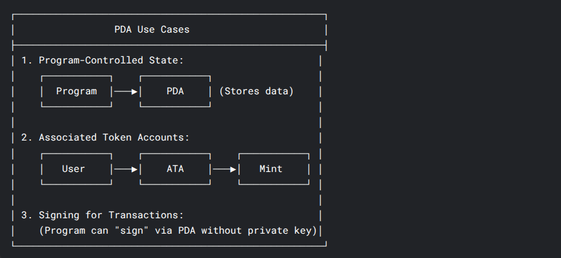

## Understanding Core Solana Programs

### Token Program

- The Token Program is a native Solana program that handles creation and management of tokens
- Responsible for:
  - Minting new tokens
  - Transferring tokens
  - Burning tokens
  - Managing token accounts

### System Program

- The fundamental program of Solana blockchain
- Handles:
  - Creating new accounts
  - Transferring SOL
  - Allocating account space
  - Assigning accounts to programs

### Mint Program vs Associated Token Account

#### Mint Account

- Represents the token itself
- Stores metadata about the token:
  - Total supply
  - Decimals
  - Mint authority
  - Freeze authority

#### Associated Token Account (ATA)

- Holds token balances for a specific wallet
- Deterministically derived for each wallet-token pair
- Features:
  - One ATA per token per wallet
  - Predictable address
  - Standard way to manage token ownership

## PDA Deep Dive

### What are PDAs?

- Program Derived Addresses (PDAs) are a unique feature of the Solana blockchain that allow developers to create addresses that are not directly controlled by a private key. Instead, PDAs are derived from a program's address and can be used for various purposes within the Solana ecosystem.

- Program Derived Addresses (PDAs) provide developers on Solana with two main use cases:

  - Deterministic Account Addresses: PDAs provide a mechanism to deterministically create an address using a combination of optional "seeds" (predefined inputs) and a specific program ID.
  - Enable Program Signing: The Solana runtime enables programs to "sign" for PDAs which are derived from the program's address.

### How to derive a PDA

The derivation of a PDA requires three inputs:

- Optional seeds: Predefined inputs (e.g. strings, numbers, other account addresses) for PDA derivation.

- Bump seed: An extra byte appended to the optional seeds to ensure a valid PDA (off curve) is generated. The bump seed starts at 255 and decrements by 1 until a valid PDA is found.

- Program ID: The address of the program from which the PDA is derived. This program can sign on behalf of the PDA.

### Program Derived Addresses (PDAs) provide developers on Solana with two main use cases:

- Deterministic Account Addresses: PDAs provide a mechanism to deterministically create an address using a combination of optional "seeds" (predefined inputs) and a specific program ID.

- Enable Program Signing: The Solana runtime enables programs to "sign" for PDAs which are derived from the program's address.

### Why PDAs Have No Private Key

1. Security: PDAs are designed to be controlled by programs, not external users
2. Off-curve requirement: PDAs must not lie on the ed25519 curve
3. Prevents private key collisions

### Common PDA Use Cases

1. Cross-Program Invocation (CPI) authorization
2. Deterministic storage locations
3. Program-controlled token accounts
4. Game state storage
5. User profile management
