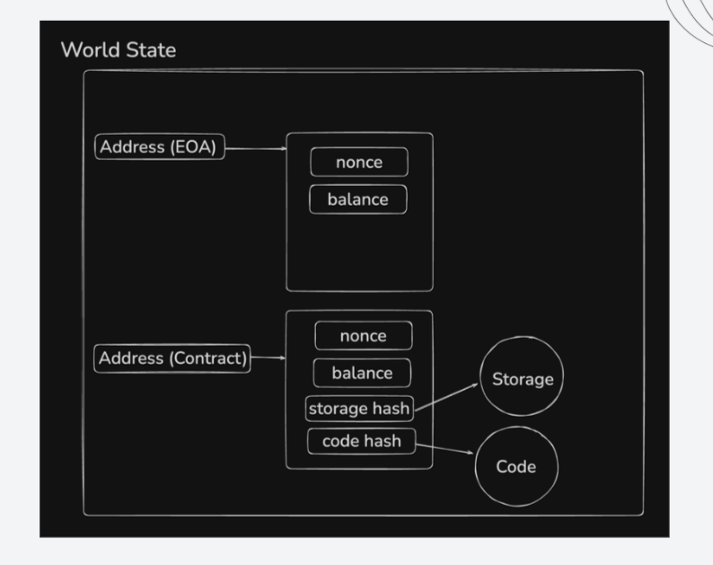
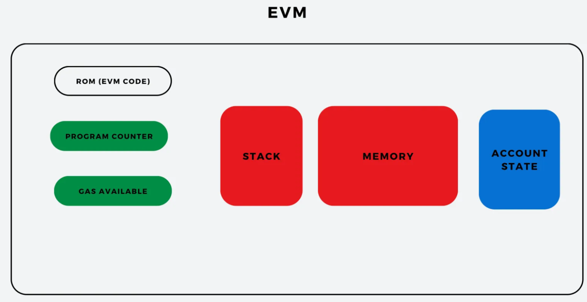

## World state in ethereum

- The world state is a mapping of addresses to account states.
- The account state contains the balance, nonce, code hash, and storage root of the account

### 1. What is the World State?

- It's a mapping between addresses (accounts) and their respective account states.

- It's constantly updated by transaction executions. Every time a transaction occurs, the world state changes to reflect the new balances, contract data, nonces, etc.

- It's not stored directly on the blockchain itself, but rather its root hash is included in each block header. This root hash cryptographically commits to the entire world state at that specific block height.

### 2. What does an Account State contain?

- Each account (both Externally Owned Accounts or EOAs, and Contract Accounts) has a state that includes:

  - `Nonce`: A transaction counter for EOAs (to prevent replay attacks) or the number of contracts created by a contract account.

  - `Balance`: The amount of Ether (ETH) held by the account, denominated in wei (1 ETH = 1018 wei).

  - `StorageRoot`: The hash of the root node of the Account Storage Trie. This trie holds all the persistent data associated with a smart contract (its variables, mapping entries, etc.). Every contract has its own storage trie.

  - `CodeHash`: The hash of the smart contract's bytecode. This is only present for contract accounts.

### 3. How is the World State Represented?

- The world state is represented using a Modified Merkle Patricia Trie (MMPT), also commonly referred to as a "state trie" or "world state trie." This data structure offers efficient ways to:

  - `Store and retrieve data`: It's optimized for searching and retrieving data based on keys (account addresses in this case).

  - `Verify data integrity`: Due to its Merkle tree properties, any change to the state will result in a different root hash, making it easy to detect tampering.

  - `Proof of inclusion/exclusion`: You can easily prove whether a particular account or piece of data is part of the state at a given block.

  ### Actual world of state



## In Ethereum, there are two fundamental types of accounts, each with distinct characteristics and capabilities:

### 1. Externally Owned Accounts (EOAs)

EOAs are the most common type of account and are controlled by a private key. They are analogous to your personal bank account.

- Key Characteristics:

  - `Controlled by Private Keys`: EOAs are secured by a private key. Whoever possesses this private key has full control over the account's funds and can initiate transactions.

  - `Human Interaction`: Primarily used by humans (or software controlled by humans) to send and receive Ether, interact with smart contracts, and deploy new contracts.

  - `No Associated Code`: EOAs do not have any executable code stored on the blockchain. They cannot directly execute logic or store complex data beyond their Ether balance.

  - `Initiate Transactions`: EOAs are the only type of account that can initiate transactions on the Ethereum network. All transactions, whether sending Ether or calling a smart contract function, must originate from an EOA.

  - `Gas Payment`: When an EOA sends a transaction, it must pay for the transaction's gas cost.

  - `Creation`: EOAs are "created" by simply generating a public/private key pair. There's no on-chain transaction required for their creation beyond the first time they receive Ether or send a transaction.

```
 Example Use Cases:

 - Holding and sending Ether.

 - Interacting with DeFi protocols (e.g., swapping tokens on Uniswap).

- Voting in DAOs.

 - Receiving NFTs.
```

### 2. Contract Accounts

- Contract accounts are self-executing programs (smart contracts) stored on the Ethereum blockchain. They are controlled by the code that is deployed to them, not by a private key.

- Key Characteristics:

  - `Controlled by Code`: Unlike EOAs, contract accounts are controlled by the code deployed at their address. This code defines their logic, functions, and how they respond to incoming transactions.

  - `Associated Code`: They have executable bytecode stored on the blockchain, which is triggered when another account (an EOA or another contract) sends a transaction to them.

  - `Can Hold Ether`: Contract accounts can hold and send Ether, just like EOAs.

  - `Cannot Initiate Transactions`: Contract accounts cannot initiate transactions on their own. They can only execute their code when triggered by an incoming transaction from an EOA or another contract.

  - `Respond to Calls`: When an EOA or another contract sends a transaction to a contract account, it executes the relevant function defined within its code.

  - `Internal State`: Contract accounts maintain their own persistent storage (data variables, mappings, etc.) on the blockchain, which is part of the world state.

  - `Creation`: Contract accounts are created when an EOA sends a special "contract creation" transaction. This transaction includes the contract's bytecode.

```
Example Use Cases:

Tokens: ERC-20 tokens, NFTs (ERC-721, ERC-1155), etc.

Decentralized Applications (dApps): The backend logic for most dApps resides in smart contracts.

Decentralized Finance (DeFi): Lending protocols, decentralized exchanges (DEXs), stablecoins.

Decentralized Autonomous Organizations (DAOs): Voting systems, treasury management.

Escrow Services: Holding funds until certain conditions are met.
```

## In Ethereum, "nonce" is a crucial concept that serves two primary purposes:

### 1. Account Nonce (for Externally Owned Accounts - EOAs)

For Externally Owned Accounts (EOAs), like your MetaMask wallet, the nonce acts as a transaction counter.

- Purpose:

  - `Preventing Replay Attacks`: Each transaction sent from an EOA has a unique, sequentially increasing nonce. This means that if you send a transaction with a nonce of 5, the next transaction you send from that address must have a nonce of 6. If someone tries to "replay" an old transaction (i.e., resend a transaction with a nonce that has already been used), the network will reject it because that nonce has already been processed.

  - `Ensuring Transaction Ordering`: The nonce guarantees that transactions from a specific EOA are processed in the correct order. Even if you send multiple transactions almost simultaneously, the network will process them based on their nonce value, ensuring that a transaction with nonce N is processed before a transaction with nonce N+1. If a transaction with a lower nonce is stuck (e.g., due to low gas fees), any subsequent transactions with higher nonces from the same address will also be stuck until the earlier one is confirmed.

  - `Unique Identifier`: It serves as a unique identifier for each transaction originating from a particular address.

#### How it works:

- When you create your first transaction from an EOA, its nonce is 0.

- For every subsequent transaction you send from that EOA, the nonce automatically increments by 1.

- The Ethereum network validates that the incoming transaction's nonce matches the expected next nonce for that account.

### 2. Contract Nonce (for Contract Accounts)

For Contract Accounts (smart contracts), the nonce has a different meaning:

- Purpose:

  - `Determining New Contract Addresses`: When a smart contract deploys another smart contract, its nonce is incremented. This nonce value, along with the deploying contract's address, is used in a cryptographic formula to determine the unique address of the newly deployed contract. This ensures that each deployment results in a unique contract address.

#### How it works:

- Unlike EOAs, a contract account's nonce doesn't track outgoing transactions. Instead, it tracks the number of new contracts that contract account has created.

- Each time a contract uses CREATE or CREATE2 opcodes to deploy a new contract, its nonce is incremented.

- Nonce in Proof-of-Work (Mining) - (Relevant for Bitcoin, less direct for Ethereum Post-Merge)
- While Ethereum has moved to Proof-of-Stake (PoS), the term "nonce" is also fundamental in Proof-of-Work (PoW) blockchains like Bitcoin. In this context:

- `Mining`: Miners compete to find a "nonce" (a "number used only once" in this specific context) that, when combined with other block data (like transactions, previous block hash, timestamp), produces a cryptographic hash that meets a certain difficulty target (e.g., starts with a certain number of zeros).

- `Trial and Error`: Miners repeatedly change the nonce (and sometimes other minor parameters) and re-hash the block data millions or billions of times until they find a nonce that results in a valid hash.

- `Difficulty Adjustment`: The difficulty target is adjusted periodically to ensure a consistent block creation rate.

## EVM (Ethereum Virtual Machine)

- The Ethereum Virtual Machine (EVM) is the runtime environment for smart contracts on the Ethereum blockchain

### 1. How it works (Simplified):

- `Smart Contract Code`: Developers write smart contracts in high-level languages like Solidity or Vyper.

- `Compilation to Bytecode`: This high-level code is then compiled into EVM bytecode, which is a low-level instruction set (opcodes) that the EVM understands.

- `Transaction Execution`: When a user (or another contract) sends a transaction to a smart contract, an Ethereum node's EVM instance executes the contract's bytecode.

- `State Changes`: During execution, the EVM reads from and writes to the world state (the global database of all accounts and their data).

- `Gas Mechanism`: Every operation (opcode) the EVM performs consumes "gas," a unit of computational effort. Users pay for this gas in Ether. This prevents denial-of-service attacks and incentivizes efficient code.

- `Deterministic Execution`: The EVM ensures that the same smart contract code, given the same inputs, will always produce the exact same output on every Ethereum node. This guarantees consistency and reliability across the decentralized network.

### 2. Key Components/Concepts:

- `Opcodes`: The fundamental instructions the EVM executes (e.g., ADD for addition, SSTORE for storing data, CALL for interacting with other contracts).

- `Stack`: A temporary data structure used by the EVM to hold values and perform operations (it's a stack-based machine).

- `Memory`: A volatile area for temporary data storage during a transaction's execution. It's cleared after each transaction.

- `Storage`: Persistent storage where a smart contract's state variables are stored. This data remains on the blockchain between transactions.

- `Gas`: The "fuel" for EVM operations. It's paid by the transaction sender and consumed by opcodes. If a transaction runs out of gas, it reverts, but the consumed gas is still paid.

- `World State`: The global, single source of truth for all account balances, contract code, and contract storage on the Ethereum blockchain. The EVM's primary role is to transition this state.

` Q. why it's called state machine not database`

#### 1. "Database" Analogy:

- A regular database is like a spreadsheet where you can just change numbers. If you want to update someone's balance, you just type a new number in their cell. There's no inherent "machine" enforcing specific rules for how those numbers change, beyond basic permissions.

#### 2. "State Machine" Analogy:

- Ethereum isn't just a spreadsheet you can edit directly. It's a spreadsheet that has a robot brain (the EVM) attached to it.

- This robot brain has a very specific rule: It only moves from one "picture" of the spreadsheet to the next "picture" based on very clear, automatic instructions.

#### `Think of it like this:`

- Current "Picture" (State): This is the entire spreadsheet right now. Everyone agrees this is the way things are.

- "Instructions" (Transactions): Someone sends a message to the robot brain saying, "Person A wants to send 5 ETH to Person B."

- Robot Brain (EVM) Processes: The robot brain doesn't just change the numbers. It first checks its rules:

  - Does Person A have 5 ETH? (Checks current state)

  - Are the rules for sending money followed? (Executes contract code if it's a contract transaction)

  - If all rules are met, it then calculates the new balances.

- New "Picture" (Next State): The robot brain then creates a completely new, updated picture of the entire spreadsheet. This new picture is cryptographically linked to the old one.

- Agreement: Every robot brain in the network (every Ethereum node) processes the exact same instructions from the same starting picture, so they all arrive at the exact same new picture. They all agree on the new "state" of the spreadsheet.

#### `Why "State Machine" is better than "Database":`

- `It emphasizes the rules for change`: A database stores data. A state machine emphasizes the process of moving from one valid data configuration (state) to another valid data configuration, only according to its defined rules.

- `It highlights the deterministic nature`: Given the same starting "picture" and the same "instructions," the robot brain will always create the exact same next "picture." There's no guesswork.

- `It implies a continuous, linked history`: You can always look at the chain of "pictures" to see exactly how the spreadsheet got to its current form, and every step is verified.

## OPCODE

#### Take a look : [evm.code](evm.codes)

#### Each part of the bytecode represents an opcode, which stands for "operation code." Opcodes are the individual instructions that tell the EVM what to do. Examples of opcodes include basic operations like:

- Arithmetic (e.g., addition or subtraction),
- Data manipulation (e.g., storing and retrieving data),
- Control flow (e.g., jump to different parts of the code based on conditions).

#### Execution in the EVM: When a smart contract is deployed or executed, the EVM reads the bytecode one opcode at a time, following each instruction to carry out the actions coded in the smart contract.

`In simple terms, opcodes are like commands in a recipe for the EVM, telling it exactly what steps to take, one at a time, to carry out the smart contract's functions.`

## ABIS

- In Ethereum, an ABI (Application Binary Interface) is like a “translation guide” that allows applications and users to interact with smart contracts. Here’s how it works in simple terms:
  - `Purpose of ABI`: When a smart contract is deployed on the Ethereum blockchain, it operates using bytecode that the Ethereum Virtual Machine (EVM) can understand. However, people and external applications need a way to communicate with this contract — for example, to call its functions or read its data. The ABI defines how this communication happens.
    - `Defining Contract Functions`: The ABI includes details about the contract's functions, specifying:
      - The names of the functions,
      - The types of inputs each function requires,
      - The types of outputs (if any) it returns.
      - This makes it clear for any application or user interface how to call specific functions on the contract.
    - `Encoding and Decoding Data`:
      - When an application sends data to the smart contract (like calling a function), the ABI tells it how to encode this data into the proper format.
      - When the contract sends data back (like returning a result), the ABI tells the application how to decode this data.
    - `Practical Example`:
      - Let’s say there’s a smart contract that has a function to check a user’s balance. The ABI would specify that to call the “checkBalance” function, you need to provide the user’s address as input, and it will return a number (the balance) as output.
      - An application, such as a wallet, would use the ABI to correctly format the call to “checkBalance” and understand the response.

`In simple terms, the ABI is a map that explains how to interact with a smart contract, making sure data is sent and received in the right way so applications and users can work with the contract accurately.`


