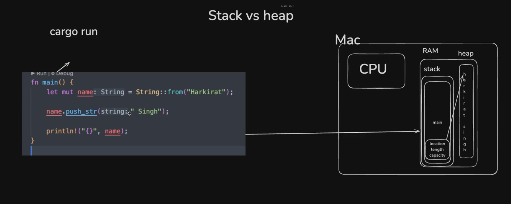

## stack and heap

Understanding the difference between **Stack** and **Heap** memory is essential in Rust, especially because Rust gives you **fine-grained control over memory** without needing a garbage collector.

---

## 🗂 Stack

- The **stack** is a region of memory where data is stored in a **last-in, first-out (LIFO)** manner.
- Stack memory is **fast** and automatically managed.
- Data on the stack must be **known and fixed in size** at compile time.

### ✅ Characteristics

- Fixed size
- Fast allocation/deallocation
- Predictable memory layout
- Automatically cleaned up

### 🧪 Example

```rust
fn main() {
let x = 5; // stack-allocated
let y = true; // stack-allocated
}
```

---

## 🗃 Heap

- The **heap** is a larger, more flexible region of memory used for storing data with **dynamic or unknown size**.
- You **must explicitly allocate** data on the heap in Rust (e.g. using `Box`, `Vec`, or `String`).
- Accessing heap memory is **slower** because it involves indirection and allocation overhead.

### ✅ Characteristics

- Dynamically sized
- Slower allocation/deallocation
- Must be manually allocated and deallocated
- Allows runtime flexibility

### 🧪 Example

```rust
fn main() {
let v = vec![1, 2, heap-allocated vector
let b = Box::new(10); // integer stored on the heap
}
```

---

## 🔍 Comparison Table

| Feature         | Stack                         | Heap                                |
| --------------- | ----------------------------- | ----------------------------------- |
| **Memory Type** | Fixed-size                    | Dynamically allocated               |
| **Speed**       | Fast (LIFO allocation)        | Slower (requires allocator)         |
| **Scope**       | Managed automatically by Rust | Managed via ownership               |
| **Usage**       | Small, static data            | Large or dynamic data               |
| **Lifetime**    | Tied to stack frame           | Controlled via ownership / Box / Rc |
| **Access**      | Direct access                 | Indirection (pointer access)        |

---

## 🤖 How Rust Handles This

Rust uses a model of **ownership and borrowing** to safely manage memory:

- Stack data is freed when it goes out of scope.
- Heap data is freed when the owner goes out of scope.
- No garbage collector!

### Example:

```rust
fn main() {
let x = 42; // Stored on the stack
let v = vec![1,          // Vector’s contents are on the heap
let b = Box::new(77);           // Integer 77 is heap-allocated
println!("x: {}, b: {}", x, b); // Box can be used like a reference

```

---

## 📌 When to Use What?

| Use Case                                       | Preferred Memory           |
| ---------------------------------------------- | -------------------------- |
| Small, known-size data                         | ✅ Stack                   |
| Dynamic-size or recursive data structures      | ✅ Heap                    |
| Short-lived temporary data                     | ✅ Stack                   |
| Need to share data across functions or threads | ✅ Heap (e.g. `Arc`, `Rc`) |

>



---

## 📦 Ownership in Rust — With Examples

Rust's **ownership system** ensures **memory safety** without needing a **garbage collector** or manual `free()`. Let's break it down with code examples.

---

## 🧠 What is Ownership?

In Rust:

- Every value has **one owner**.
- Ownership can be **moved**.
- When the owner goes out of scope, the value is **dropped** (i.e., memory is freed).

---

## ✏️ Ownership Rules Recap

1. **Each value has a single owner.**
2. **Only one owner at a time.**
3. **Value is dropped when the owner goes out of scope.**

---

## 🧪 Code: Basic Ownership Example

```rust
fn main() {
let s = String::from("hello"); // s owns the string
println!("{}", s); // works fine here
} // s goes out of scope and is dropped

✅ Output: hello

```

- The `String` is created on the heap.
- `s` is the owner.
- When `s` goes out of scope, Rust automatically calls `drop()` and frees the memory.

---

## 🔁 Move Semantics

```rust
fn main() {
let a = String::from("apple");
let b = a; // ownership of the String is moved from a to b

// println!("{}", a); // ❌ ERROR: value borrowed after move
println!("{}", b);     // ✅ Works

✅ Output:apple

```

> 🔐 Why does `a` become invalid?  
> Rust prevents double-free errors. Since `b` now owns the string, `a` can't access it again.

---

## 🔁 Copy Types (Like Numbers)

Some types implement the `Copy` trait and **don’t move**, they’re just copied.

```rust
fn main() {
let x = 10;
let y = x; // value is copied

println!("x = {}, y = {}", x, y); // ✅ both are valid
}


✅ Output: x = 10, y = 10
```

📝 Types that implement `Copy`:

- Integers (`i32`, `u32`, etc.)
- Booleans
- Characters
- Fixed-size arrays
- Tuples of `Copy` types (e.g., `(i32, bool)`)

---

## ⚙️ Ownership Across Functions

### 🔁 Passing Ownership

```rust
fn main() {
let s = String::from("rust");
takes_ownership(s); // ownership moved
// println!("{}", s); // ❌ can't use s anymore
}

fn takes_ownership(val: String) {
println!("Got: {}", val);
}

✅ Output: Got: rust
```

---

### 🔁 Returning Ownership

```rust
fn main() {
let s1 = gives_ownership(); // s1 takes ownership
let s2 = String::from("hello");
let s3 = takes_and_returns(s2); // ownership moves through function
println!("{}", s1);
println!("{}", s3);
}

fn gives_ownership() -> String {
String::from("from fn")
}

fn takes_and_returns(s: String) -> String {
s
}

✅ Output:
from fn
hello
```

---

## 🔄 Clone Instead of Move

Use `.clone()` if you want to **copy heap data**.

```rust
fn main() {
let s1 = String::from("data");
let s2 = s1.clone(); // deep clone, both are valid
println!("s1 = {}, s2 = {}", s1, s2);

✅ Output:
s1 = data, s2 = data
}
```

---

## 🛑 Summary

| Concept              | Owned? | Can Reuse After Move? | Can Clone It? |
| -------------------- | ------ | --------------------- | ------------- |
| `String::from("hi")` | Yes    | ❌ No                 | ✅ Yes        |
| `i32 = 2`            | Yes    | ✅ Yes (Copy)         | ✅ N/A        |

---

## ✅ Ownership in a Nutshell

| Rule | Description                                                               |
| ---- | ------------------------------------------------------------------------- |
| 1️⃣   | Each value has only one owner.                                            |
| 2️⃣   | On assignment or function-passing, ownership **moves**.                   |
| 3️⃣   | When the owner goes out of scope, the value is **dropped** automatically. |

## 🔄 Borrowing and References in Rust (with examples)

In Rust, **borrowing** is the mechanism that allows you to **use a value without taking ownership** of it. This is done using **references**.

Borrowing is central to Rust's **ownership system** and helps prevent issues like **data races**, **dangling pointers**, and **unintended mutations** — all at **compile time**!

---

## 🧠 What are References?

A **reference** allows you to refer to a value **without taking ownership**. You create a reference using `&`.

There are two types:

1. ✅ **Immutable references** (`&T`)
2. ✏️ **Mutable references** (`&mut T`)

---

## ✅ Immutable Borrowing (`&T`)

- Multiple immutable references **are allowed at the same time**.
- The original value **cannot be modified** via immutable references.

### 🧪 Example

```rust
fn main() {
let s = String::from("rustacean");
print_length(&s);
println!("Original: {}", s); // s is still valid
}

fn print_length(s: &String) {
println!("Length: {}", s.len());
}


✅ Output:
Length: 9
Original: rustacean
```

- `&s` passes a reference to `print_length` without giving up ownership.
- `s` remains accessible in `main`.

---

## ✏️ 2. Mutable References (`&mut T`)

You can only have **one mutable reference** to a piece of data at a time.

### ✅ Example:

```rust

fn main() {
let mut s = String::from("hello");
change(&mut s);
println!("Modified: {}", s);
}

fn change(s: &mut String) {
s.push_str(", world!");
}


✅ Output:
Modified: hello, world!

```

- The function `change` modifies the `String` by borrowing it mutably with `&mut`.

---

## ⚠️ 3. Borrowing Rules

| 🛡️ Rule | Explanation                                 |
| ------- | ------------------------------------------- |
| ✅      | You may have **many immutable** references. |
| ✅      | Or you may have **one mutable** reference.  |
| ❌      | Never both at the same time.                |

### ❌ Invalid Example:

```rust

fn main() {
let mut s = String::from("oops");

text
let r1 = &s;
let r2 = &mut s; // ❌ Error: Can't borrow as mutable
}


✅ Fix by separating scopes:

fn main() {
let mut s = String::from("fixed");

text
{
let r1 = &s;
println!("Read-only: {}", r1);
} // r1 ends here

{
let r2 = &mut s;
r2.push_str("!");
println!("Mutable: {}", r2);
}
}

```

---

## 💣 4. No Dangling References

Rust prevents references to invalid memory — i.e., **dangling references** — at compile time.

### ❌ Example that won't compile:

```rust
fn dangle() -> &String {
let s = String::from("oops");
&s // ❌ Reference to value that will be dropped
}

```

Rust’s **borrow checker** ensures references never outlive the values they refer to.

---

## 🔁 5. References Don't Transfer Ownership

Using a reference keeps the original owner valid:

```rust
fn main() {
let s1 = String::from("hello");
let len = length(&s1); // borrow s1
println!("{} has length {}", s1, len); // still valid
}

fn length(s: &String) -> usize {
s.len()
}
```

---

## 📌 Summary Table

| Feature           | Immutable Reference         | Mutable Reference           |
| ----------------- | --------------------------- | --------------------------- |
| Syntax            | `&T`                        | `&mut T`                    |
| How many allowed? | Multiple at once ✅         | Only one at a time ❗       |
| Allows mutation?  | ❌ No                       | ✅ Yes                      |
| Ownership moved?  | ❌ No                       | ❌ No                       |
| Safety guarantees | ✅ Enforced at compile time | ✅ Enforced at compile time |
