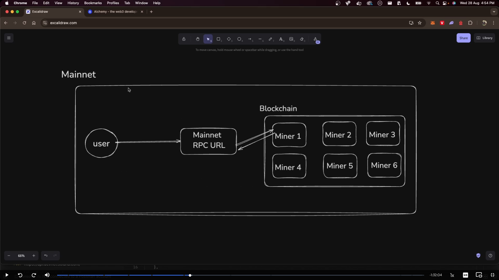
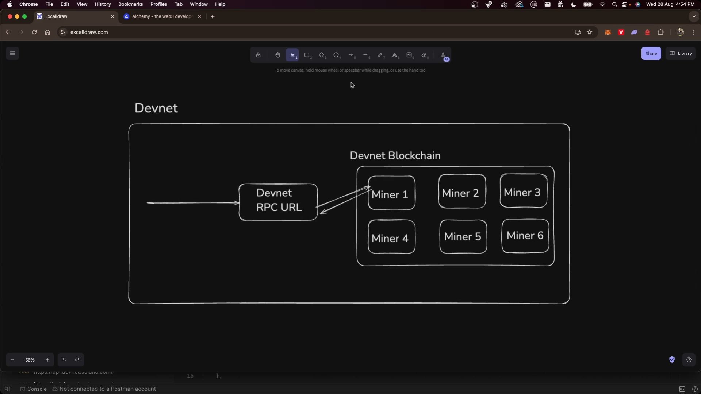
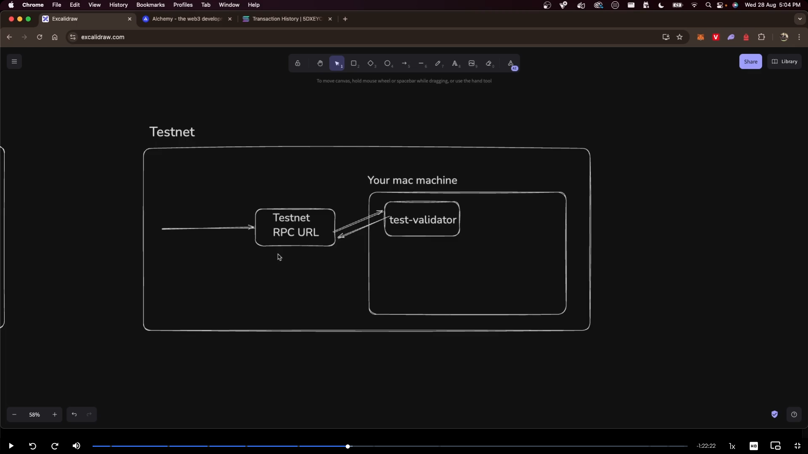
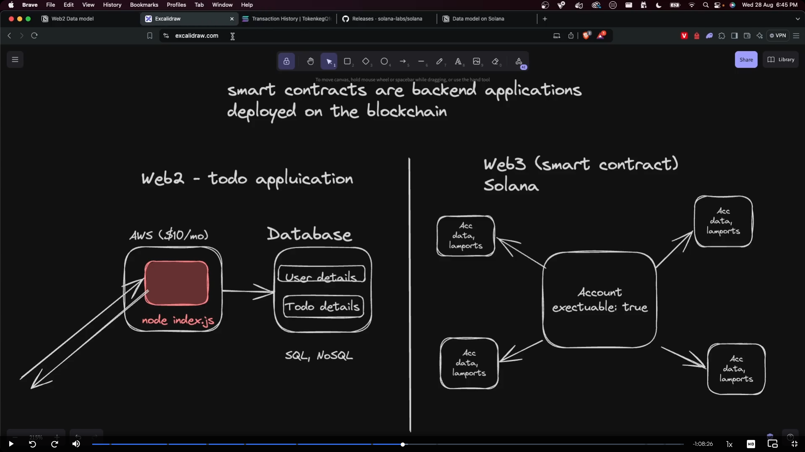
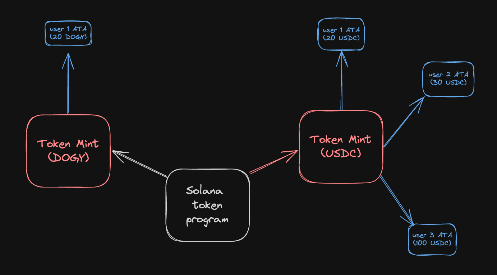
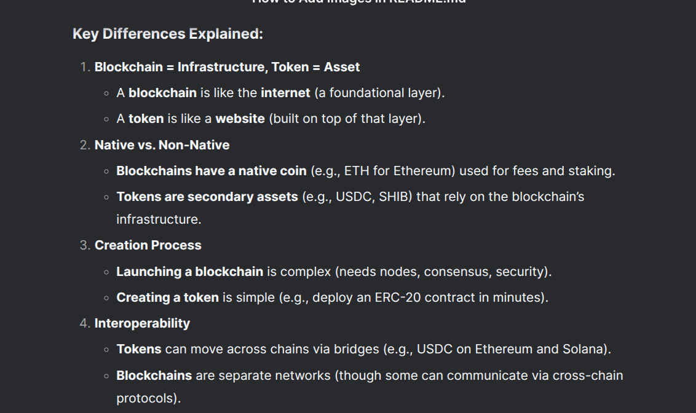

# Solana Jargon, Programming model, Tokens

## 1. rpc in solana

- rpc in solana is a way to interact with the solana blockchain
- it is a set of APIs that allow you to send transactions, query account balances, and more

## 2. mainnet

- mainnet is the main network of solana
- it is the production network where real transactions take place
- it is the network that is used by most users and developers
- it is the network that is used to deploy real applications and smart contracts

```bash
# set the mainnet as the default network
solana config set --url https://api.mainnet-beta.solana.com
```



## 3. devnet

- devnet is a test network of solana
- it is used for testing and development purposes
- it is a free network where users can test their applications without using real money
- it is a good place to experiment with new features and test your code before deploying it to mainnet
- it is used to test new features and changes before they are deployed to mainnet

```bash
# set the devnet as the default network
solana config set --url https://api.devnet.solana.com
```



## 4. testnet

- testnet is another test network of solana
- it is used for testing and development purposes
- it is similar to devnet but has different parameters and configurations
- it is a good place to test your code before deploying it to mainnet
- it is used to test new features and changes before they are deployed to mainnet



## 5. Data model on Solana

- Solana uses a data model that is based on accounts
- Each account has a unique address and can hold data
- Accounts can be owned by different programs and can be used to store different types of data
- Accounts can be read and written to by different programs
- Accounts can be used to store different types of data, such as balances, transaction history, and more



### why solana make this data model

- Solana uses a data model that is based on accounts to provide a simple and efficient way to store and access data
- The account-based model allows for easy access to data and reduces the complexity of managing data

## 6. Tokens

- Tokens are a way to represent value on the Solana blockchain
- Tokens can be used to represent different types of assets, such as currencies, stocks, and more



- Creating `your own token` (100x coin lets say) requires understanding the `Token Program` that is written by the engineers at Solana - https://github.com/solana-labs/solana-program-library

- Specifically, the way to create a `token` requires you to

1. Create a token mint
2. Create an `associated token account` for this mint and for a specific user
3. Mint tokens to that user.

### Token mint

- It’s like a `bank` that has the athority to create more coins. It can also have the authority to `freeze coins`.


### difference between token and blockchain

- Tokens are a way to represent value on the Solana blockchain, while the blockchain itself is a decentralized ledger that records all transactions and data on the network.
- Tokens are built on top of the blockchain and use its infrastructure to operate, but they are not the same thing as the blockchain itself.


