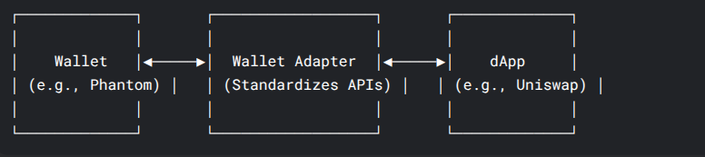

# Wallet Adapter

## Wallet, dApp, and Wallet Adapter: Key Differences

### 1. Wallet

**What it is:**  
A cryptocurrency wallet (e.g., MetaMask, Phantom, Ledger) that stores private keys and interacts with blockchains. Allows users to sign transactions, manage assets, and authenticate identity.

#### Key Functions:

- Stores public/private key pairs.
- Signs transactions securely.
- Connects to dApps to authorize actions (e.g., swapping tokens).

#### Example Wallets:

- **Ethereum**: MetaMask, Coinbase Wallet
- **Solana**: Phantom, Solflare
- **Hardware**: Ledger, Trezor

---

### 2. dApp (Decentralized Application)

**What it is:**  
A blockchain-based app (e.g., Uniswap, OpenSea) that runs on smart contracts. Requires wallet integration for user interactions.

#### Key Functions:

- Provides a frontend UI (website/app).
- Sends transaction requests to wallets for signing.
- Reads/writes data to the blockchain (via wallets or RPC nodes).

#### Example dApps:

| Category | Example | Blockchain |
| -------- | ------- | ---------- |
| DeFi     | Uniswap | Ethereum   |
| NFT      | OpenSea | Ethereum   |
| GameFi   | StepN   | Solana     |

---

### 3. Wallet Adapter

**What it is:**  
A bridge/library that standardizes connections between dApps and multiple wallets. Solves fragmentation by eliminating the need for custom wallet integrations.

#### Key Functions:

- Provides a unified API (e.g., `connect()`, `signTransaction()`).
- Supports multiple wallets in one dApp.
- Handles chain-specific quirks (e.g., Solana vs. Ethereum signing).



## how wallet adapter knows that I have a wallet installed?

**Browser Detection**: Checks for wallet-specific browser extensions (e.g., `window.ethereum` for MetaMask).

for example
```javascript
function detectWallets() {
  const wallets = [];
  
  // EVM Wallets
  if (window.ethereum) {
    if (window.ethereum.isMetaMask) wallets.push('MetaMask');
    if (window.ethereum.isBraveWallet) wallets.push('Brave');
    if (window.ethereum.isCoinbaseWallet) wallets.push('Coinbase');
  }

  // Solana Wallets
  if (window.phantom?.solana) wallets.push('Phantom');
  if (window.solflare) wallets.push('Solflare');

  return wallets.length ? wallets : ['None detected'];
}
```


